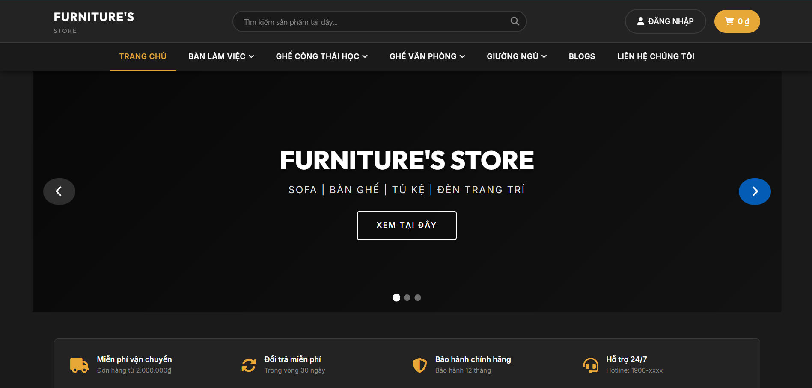
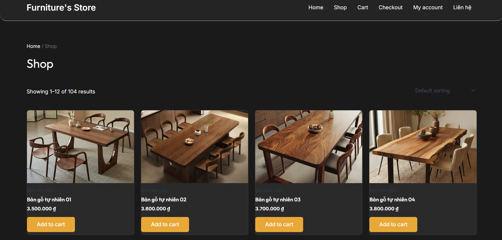
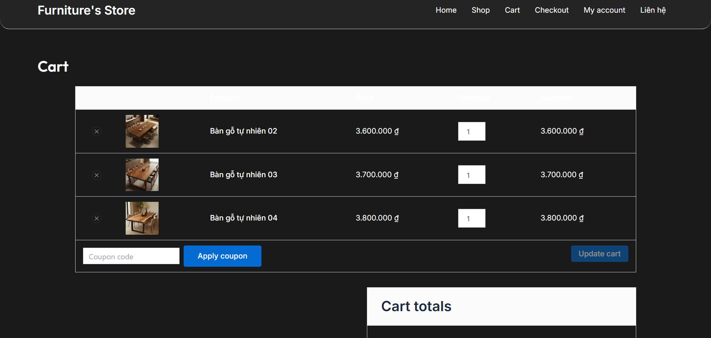
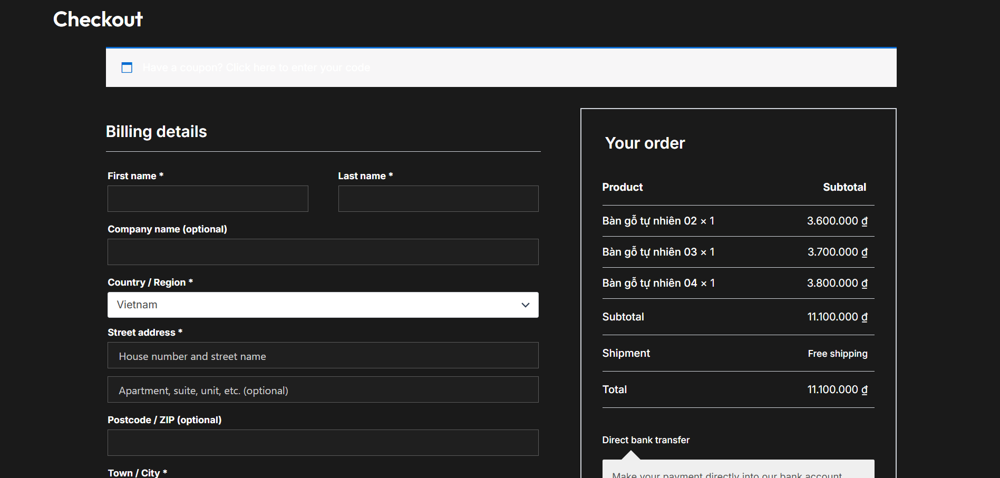

# 🛋️ Tên đề tài: Xây dựng Website Thương mại điện tử Cửa hàng Nội thất (Furniture's Store)

## 📖 Giới thiệu website/hệ thống
Furniture's Store là một hệ thống website thương mại điện tử chuyên cung cấp các sản phẩm nội thất hiện đại (sofa, bàn làm việc, ghế công thái học, giường ngủ...). 
Website được thiết kế với giao diện trực quan, sang trọng (Dark mode), tối ưu hóa trải nghiệm người dùng (UX/UI). Hệ thống tích hợp đầy đủ các tính năng của một trang TMĐT chuyên nghiệp bao gồm: quản lý sản phẩm, giỏ hàng, thanh toán, quản lý tài khoản khách hàng, và form liên hệ. Ngoài ra, hệ thống còn tích hợp một plugin tự xây dựng (Custom Plugin) để quản lý chức năng riêng biệt.


## 🛠️ Công nghệ sử dụng
* **Mã nguồn lõi:** WordPress
* **Ngôn ngữ lập trình:** PHP, CSS, HTML, JavaScript
* **Cơ sở dữ liệu:** MySQL
* **Giao diện (Theme):** Astra & Astra Child Theme (phục vụ tùy biến code)
* **Trình dựng trang (Page Builder):** Spectra (Brainstorm Force)
* **Các Plugin cốt lõi:**
  * WooCommerce (Quản lý bán hàng)
  * Contact Form 7 (Quản lý biểu mẫu liên hệ)
  * Plugin tự phát triển ("Sinh viên")
* **Môi trường Deploy:** InfinityFree Hosting / phpMyAdmin

## ⚙️ Hướng dẫn cài đặt

1. **Chuẩn bị môi trường:** Cài đặt phần mềm XAMPP (hoặc WAMP, Laragon) trên máy tính.
2. **Clone mã nguồn:** * Tải toàn bộ mã nguồn từ Repository này về máy.
   * Giải nén và chép thư mục code vào đường dẫn: `C:\xampp\htdocs\LongWEB`
3. **Cài đặt Cơ sở dữ liệu:**
   * Khởi động Apache và MySQL trên XAMPP.
   * Truy cập `http://localhost/phpmyadmin`.
   * Tạo một Database mới (ví dụ: `furniture_db`).
   * Import file CSDL `qlsv.sql` (đính kèm trong thư mục repo) vào Database vừa tạo.
4. **Cấu hình kết nối:**
   * Mở file `wp-config.php` trong thư mục gốc của code.
   * Chỉnh sửa các thông số kết nối Database tương ứng:
     ```php
     define( 'DB_NAME', 'furniture_db' );
     define( 'DB_USER', 'root' );
     define( 'DB_PASSWORD', '' );
     ```

## ▶️ Hướng dẫn chạy project
1. Đảm bảo XAMPP (Apache & MySQL) đang hoạt động.
2. Mở trình duyệt web, truy cập vào đường dẫn: `http://localhost/LongWEB/` để xem trang chủ khách hàng.
3. Để truy cập trang quản trị Admin, vào đường dẫn: `http://localhost/LongWEB/wp-admin`

## 🔑 Tài khoản demo
  * Tên đăng nhập: `admin`
  * Mật khẩu: `root`

## 🖼️ Hình ảnh minh họa hệ thống
* **Giao diện Trang chủ:**



* **Giao diện Cửa hàng (Shop):**



* **Giao diện Giỏ hàng (Cart):**



* **Giao diện Checkout:**



## 🎥 Link video demo
* Xem video giới thiệu và hướng dẫn thao tác hệ thống tại đây: **https://drive.google.com/file/d/1pRvq1HxDNQeJwEoXaRHwS4wQYOOSBr07/view?usp=sharing**

## 🌐 Link online đã deploy
* Website hiện đã được đưa lên máy chủ và hoạt động trực tuyến tại: **[http://furniturestore.infinityfreeapp.com](http://furniturestore.infinityfreeapp.com)**
